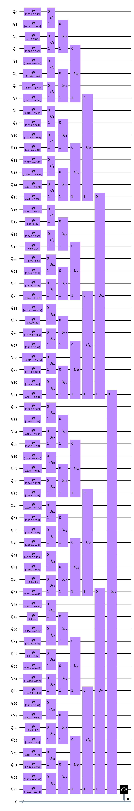
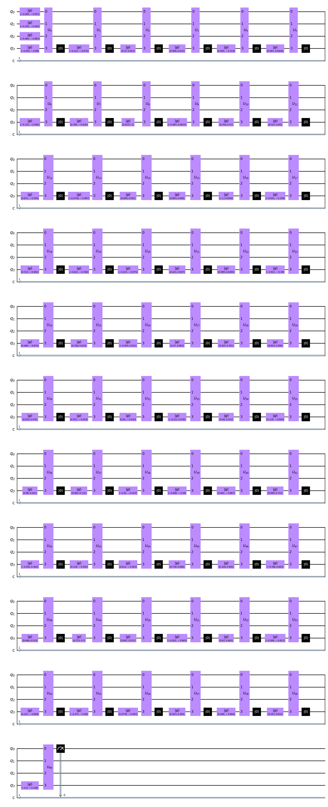

# Tensor Networks on Qiskit
## Seminar on Advanced Topics on Quantum Computing - WS 22/23
## Isaac Nunez Araya
---
### **Description**
This project implementes the discriminative algorithm described in [Towards Quantum Machine Learning with Tensor Networks](https://arxiv.org/pdf/1803.11537.pdf) using [Qiskit](https://qiskit.org/). It provides three types of circuits: base, efficient, and experimental. The latter two are described in the paper while the experimental is created by me seeking to improve the shortcomings of the models proposed in the paper.

#### **Base Circuit**



#### **Efficient Circuit**



#### **Experimental Circuit**


### **Installation**

First clone the repository from:

```
$ git clone ...
$ cd qml/
```

Then follow the installation process for [Tensorflow with Conda](https://www.tensorflow.org/install/pip).

#### _User-mode installation of TF_
If you do not poses root access in your machine, use the **Step 4: GPU Setup** from the guide to enable local installation paths for Conda and Python. Please add them to the Activate scripts by doing:
```
mkdir -p $CONDA_PREFIX/etc/conda/activate.d
echo 'export LD_LIBRARY_PATH=$LD_LIBRARY_PATH:$CONDA_PREFIX/lib/:$HOME/.local' > $CONDA_PREFIX/etc/conda/activate.d/env_vars.sh
echo 'export PYTHONPATH=$HOME/.local/lib/python3.9/site-packages:$PYTHONPATH >> $CONDA_PREFIX/etc/conda/activate.d/env_vars.sh
```

> Remember to perform this actions while you have the previously Conda environments activated.

#### _Hardware Acceleration_
When installing Tensorflow with Conda and your machine poses an NVIDIA GPU Card, please follow the instructions to install CUDA and CUDNN.

To install the Python dependencies which enables hardware acceleration, install them using the GPU requirements file by doing:

```
pip install --user --force-reinstall -r requirements_gpu.txt
```

This should install all the necessary dependencies to your local path.

#### _Without Hardware Acceleration_
After finishing up the [Tensorflow with Conda](https://www.tensorflow.org/install/pip) guide, install the necessary dependencies using:
```
pip install --user --force-reinstall -r requirements_cpu.txt
```

### **Usage**
To run a demo circuit specified in [here](network/tensor_network.py#L427):

1. Activate your Conda environment
2. Navigate into `qml`
3. Execute `python3 -m network.tensor_network` 

or you can import by specifying in your Python file 

`import network.tensor_network`

Since the Network is implemented as a Class, your class can inherit from the `Network` class.