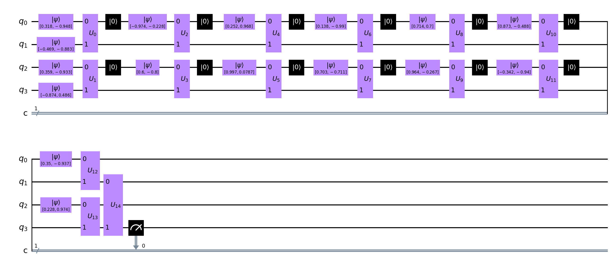

# Tensor Networks on Qiskit
## Seminar on Advanced Topics on Quantum Computing - WS 22/23
## Isaac Nunez Araya
---
### Table of Contents
- [Tensor Networks on Qiskit](#tensor-networks-on-qiskit)
  * [Description](#--description--)
  * [The circuits](#--the-circuits--)
  * [Installation](#--installation--)
    - [_User-mode installation of TF_](#-user-mode-installation-of-tf-)
    - [_Hardware Acceleration_](#-hardware-acceleration-)
    - [_Without Hardware Acceleration_](#-without-hardware-acceleration-)
  * [Usage](#--usage--)
  * [Presentation](#--presentation--)
  * [Import in your project](#--import-in-your-project--)

### **Description**
This project implementes the discriminative algorithm described in [Towards Quantum Machine Learning with Tensor Networks](https://arxiv.org/pdf/1803.11537.pdf) using [Qiskit](https://qiskit.org/). It provides three types of circuits: base, efficient, and experimental. The latter two are described in the paper while the experimental is created by me seeking to improve the shortcomings of the models proposed in the paper.

### **The circuits**

<font size="1">These images represent the circuits for input data of 4x4. If you wish to see the circuits for images of 8x8, please refer to the folder [circuits](circuits/).</font>

|Base Circuit| Efficient Circuit|Experimental Circuit|
|------------|------------------|--------------------|
||||


1. The **base circuit** represents the basal implementation of the MPS defined by the authors. The hyperparameters defined in the paper are for this model. For an image of 8x8, it uses 1008 trainable parameters while for an image of 4x4, it uses 240.
2. The **efficient circuit** represents a reordering of the MPS defined from the base circuit. The goal is to use less qubits since physically, that's our limitation but it increases the model parameters from 1008 to 15616 for an image of 8x8 and to 3328 for an image of 4x4.
3. The **experimental circuit** is not proposed in the paper but rather is attempt to reduce three aspects: (a) the number of model parameters, (b) the number of qubits, and (c) the time per batch with the goal to improve training (and testing) accuracy. The experimental circuit provides the same model parameters as the base circuit with the number of qubits as the efficient circuit and in some cases, it results in better **training** and **testing** accuracy than those cited in the paper. For more comparisons, view [1], [2], [3], [4], [5].
  
    The model represented in [1] resulted in 63% **testing** accuracy. While with multiple runs of the efficient model, the **testing** accuracy was never above <font color="red">55%</font>. The hyperparameters were:
    
    * $a = 0.05$
    * $A = 5$
    * $\lambda = 0$
    * $\gamma = 1$
    * $\eta = 1$
    * $s = 0.602$
    * $t = 0.101$
    * $b = 0.01$
    * batch size = 13
    * samples = 4000 (3200 for training and 1800 for testing)

[1]: results/experimental_13/circuit_experimental_accuracy_4x4.png "Experimental circuit with batch size of 13 and an image 4x4"
[2]: results/experimental_20/circuit_experimental_accuracy_4x4.png "Experimental circuit with batch size of 13 and an image 4x4"
[3]: results/experimental_20/circuit_experimental_accuracy_8x8.png "Experimental circuit with batch size of 13 and an image 8x8"
[4]: results/efficient/circuit_efficient_accuracy_4x4.png "Efficient circuit with batch size of 13 and an image 4x4"
[5]: results/efficient/circuit_efficient_accuracy_8x8.png "Efficient circuit with batch size of 13 and an image 4x4"
### **Installation**

First clone the repository from:

```bash
$ git clone git@github.com:IsaacNez/qml.git
$ cd qml/
```

Then follow the installation process for [Tensorflow with Conda](https://www.tensorflow.org/install/pip).

#### _User-mode installation of TF_
If you do not poses root access in your machine, use the **Step 4: GPU Setup** from the guide to enable local installation paths for Conda and Python. Please add them to the Activate scripts by doing:

```bash
mkdir -p $CONDA_PREFIX/etc/conda/activate.d
echo 'export LD_LIBRARY_PATH=$LD_LIBRARY_PATH:$CONDA_PREFIX/lib/:$HOME/.local' > $CONDA_PREFIX/etc/conda/activate.d/env_vars.sh
echo 'export PYTHONPATH=$HOME/.local/lib/python3.9/site-packages:$PYTHONPATH >> $CONDA_PREFIX/etc/conda/activate.d/env_vars.sh
```

> Remember to perform this actions while you have the previously Conda environments activated.

#### _Hardware Acceleration_
When installing Tensorflow with Conda and your machine poses an NVIDIA GPU Card, please follow the instructions to install CUDA and CUDNN.

To install the Python dependencies which enables hardware acceleration, install them using the GPU requirements file by doing:

```bash
pip install --user --force-reinstall -r requirements_gpu.txt
```

This should install all the necessary dependencies to your local path.

#### _Without Hardware Acceleration_
After finishing up the [Tensorflow with Conda](https://www.tensorflow.org/install/pip) guide, install the necessary dependencies using:

```bash
pip install --user --force-reinstall -r requirements_cpu.txt
```

### **Usage**
To run a demo circuit specified in [here](network/tensor_network.py#L427):

1. Activate your Conda environment
2. Navigate into `qml`
3. Execute `python3 -m network.tensor_network` 

or you can import by specifying in your Python file 

`import network.tensor_network`

Since the Network is implemented as a Class, your class can inherit from the `Network` class.

### **Presentation**
To run the presentation, inside the `qml` folder, run the following command:

```bash
jupyter nbconvert presentation/presentation.ipynb --to slides --post serve
```

After executing said command, it should launch a tab on your browser.

### **Import in your project**

If you wish to improve the model here present, you can import the `Network`, `Dataloader` or `QuantumOperator` classes to your project and use it from there. To do so, please use:

```python
from network.quantum import QuantumOperator
```
or
```python
from network.tensor_network import Network
```
or
```python
from utils.dataloader import Dataloader
```

The module `utils.utils` provide tools to display or save images using the Matplotlib backend. 